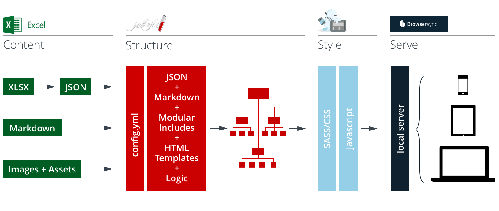

## Welcome to Content First Prototyping!

This framework is intended to get you up and running with content driven prototypes in no time. Noodle around in this little starter playground for a bit and get your head around how it works – then swap out the starter data with your own content and build out your own project from the content up. 

### How It Works
The Content First Prototype Framework takes your structured content from Excel Spreadsheets and assembles it into simple templates using Jekyll, then presents everything to you in interconnected pages styled with Foundation. When you initially build your prototype, all the pieces are automatically put in place. Whenever you save changes to content, template, or style files, the system updates your build and serves the changes to your device(s).

### Technologies
You'll need to know a little bit of HTML and CSS to get the most out of this tool. If you're new to markup (or to Jekyll and Foundation), check out their excellent documentation:

<h4>Jekyll</h4>

Jekyll is a static site generator that turns plain text into static websites. It is "blog aware," which means that permalinks, categories, pages, posts, and custom layouts are all first-class citizens. <a href="http://jekyllrb.com/docs/home/">Go to the docs >></a>

<h4>Foundation</h4>

Foundation is a collection of HTML, CSS, and JavaScript containing design patterns that you can build upon. Foundation lets you get working code in the browser quickly using established patterns and interactions. <a href="http://foundation.zurb.com/sites/docs/">Go to the docs >></a>

#### Don't Panic!
If all of this looks overwhelming, don't worry – you don't need to be a front end pro to get the most out of this framework. In fact, you can build lots of basic elements, layouts, and interactivity from these sample pages and the Foundation tear sheet included with this package. 

### How the Content Gets In
The Content First Prototyping Framework works by pulling your actual content out of Excel spreadsheets and generating a page for each content row in your data set. Why Excel? Because it puts content in a structured format that stakeholders, designers, and developers can all understand. It's also a format that you can easily change and experiement with, freeing you up to experiment and find the optimal model for your content (i.e. the one that makes the most sense to your users), without needing to futz around with databases and or remote feeds.

Below are three sets of structured content pulled from the _data spreadsheet (in the _data file). Open it up and try changing around the values. The site will update automatically, reflecting your changes. 



### Adding Style
These starter pages are styled as monochrome wireframes on purpose. At an initial stage of design, the goal of Content First Prototyping is to make sure that the overall structure and arrangment of content makes sense: categories, labels, hierarchy and the metadata and logic that strings it all together. Once you've got all that working, go crazy with colors, shadows, texture, whatever. Foundation makes it easy to add in color, motion, and dynamic behavior to help you further refine (and test) your design. 